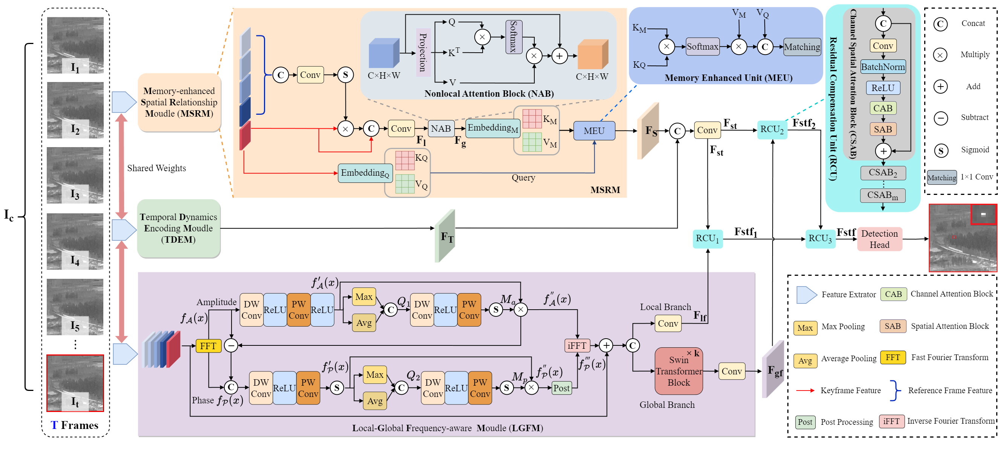
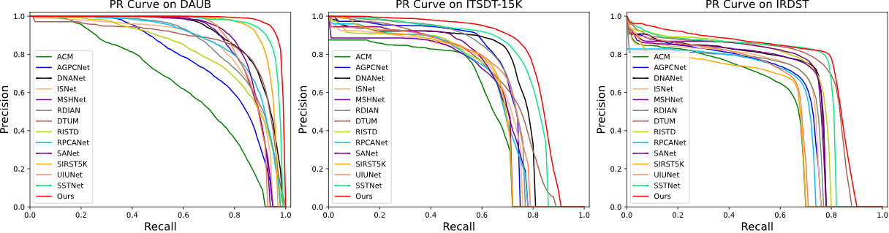

# Tridos
This is the respository of  Tridos.

Triple-domain Feature Learning with Frequency-aware Memory Enhancement for Moving Infrared Small Target Detection

Our paper is accepted to "IEEE Trans. on Geoscience and Remote Sensing (TGRS) 2024".

Currently, it is still in the process of refinement. After the formal publication of the paper, the code will be further improved.

## Abstract
Moving infrared small target detection presents significant challenges due to tiny target sizes and low contrast against backgrounds. Currently-existing methods primarily focus on extracting target features only from the spatial-temporal domain. For further enhancing feature representation, more information domains such as frequency are believed to be potentially valuable.  To extend target feature learning, we propose a new Triple-domain Strategy (Tridos) with the frequency-aware memory enhancement on the spatial-temporal domain. In our scheme, it effectively detaches and enhances frequency features by a local-global frequency-aware module with Fourier transform. Inspired by the human visual system, our memory enhancement aims to capture the target spatial relations between video frames. Furthermore, it encodes temporal dynamics motion features via differential learning and residual enhancing.
Additionally, we further design a residual compensation unit to reconcile possible cross-domain feature mismatches.
To our best knowledge, our Tridos is the first work to explore target feature learning comprehensively in spatial-temporal-frequency domains. The extensive experiments on three datasets (DAUB, ITSDT-15K, and IRDST) validate that our triple-domain learning scheme could be obviously superior to state-of-the-art ones.

## Prerequisite
- python == 3.8
- pytorch == 1.10.0
- einops == 0.7.0
- opencv-python == 4.7.0.72
- scikit-learn == 1.2.2
- scipy == 1.9.1
- Tested on Ubuntu 20.04.6, with CUDA 12.0, and 1x NVIDIA 3090(24 GB)

## PR Curve


## Datasets
- You can download them directly from the website: [DAUB](https://www.scidb.cn/en/detail?dataSetId=720626420933459968), [ITSDT-15K](https://www.scidb.cn/en/detail?dataSetId=de971a1898774dc5921b68793817916e&dataSetType=journal), [IRDST](https://xzbai.buaa.edu.cn/datasets.html).
- The COCO format json file needs to be converted into a txt format file. 
```
python utils_coco/coco_to_txt.py
```
## Usage
### Train
```
CUDA_VISIBLE_DEVICES=0 python train_{dataset}.py
```
### Test
- Usually model_best.pth is not necessarily the best model. The best model may have a lower val_loss or a higher AP50 during verification.
```
CUDA_VISIBLE_DEVICES=0 python vid_map_coco.py
```
### Visulization
```
python vid_predict.py
```
## Reference
1、Z. Ge, S. Liu, F. Wang, Z. Li, and J. Sun, “Yolox: Exceeding yolo series in 2021,” arXiv preprint arXiv:2107.08430, 2021.

## Contact
IF any questions, please contact with Weiwei Duan via email: [dwwuestc@163.com]().

## Update
- 2024.09.13 All codes are released!

## Citation
If you find this repo useful, please cite our paper.
```
@ARTICLE{10663463,
  author={Duan, Weiwei and Ji, Luping and Chen, Shengjia and Zhu, Sicheng and Ye, Mao},
  journal={IEEE Transactions on Geoscience and Remote Sensing}, 
  title={Triple-domain Feature Learning with Frequency-aware Memory Enhancement for Moving Infrared Small Target Detection}, 
  year={2024},
  volume={},
  number={},
  pages={1-1},
  keywords={Feature extraction;Frequency-domain analysis;Object detection;Representation learning;Fourier transforms;Data mining;Visual systems;Moving Infrared Small Target Detection;Triple-domain Feature Learning;Fourier Transform;Frequency Aware;Memory Enhancement},
  doi={10.1109/TGRS.2024.3452175}}

```
